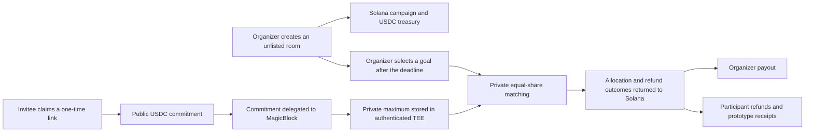

# Compart

### Private group checkout for plans that only work when enough people commit

[**Launch the live app**](https://compart-mocha.vercel.app/) · [GitHub Pages mirror](https://techkeyy.github.io/compart/) · [View the Solana program](https://explorer.solana.com/address/E2jBtfWynBhkA7yxXfNFPrhpKuEZwweuvb1GDNzkRDEh?cluster=devnet) · [Watch the demo](./DEMO_SCRIPT.md)

Compart helps friends coordinate a shared purchase without turning a group chat into a public comparison of everyone’s budget.

An organizer opens an unlisted room for a trip, event, stay, subscription, group order, or any other shared plan. Invitees place the same visible, refundable escrow cap in devnet USDC, while each person’s real spending limit is submitted privately. At the deadline, Compart checks whether the group can cover an agreed total and publishes only the outcome needed to settle on Solana.

No participant has to announce what they can afford. No organizer has to front the entire bill. The group gets one verifiable answer: **can this plan clear, or should everyone be refunded?**

> **Prototype status:** Compart is a hackathon build running exclusively on Solana devnet. Devnet SOL and devnet USDC are test assets with no real-world value. It is not a booking platform, custodian, marketplace, or production payment product.

## The problem

Shared purchases usually fail before checkout:

- people have different budgets but do not want to reveal them;
- the organizer cannot tell whether the plan is genuinely affordable;
- one person is often expected to carry the financial risk;
- verbal promises are difficult to verify and easy to abandon;
- collecting money manually creates refund and reconciliation work.

Compart turns that coordination problem into a private, time-bound group fund with public settlement rules.

## How Compart works

### 1. The organizer defines the deal

The organizer creates an unlisted room with:

- the number of people required;
- an equal public escrow cap per participant;
- a minimum and maximum acceptable group total;
- a commitment deadline; and
- plain-language details and terms.

The organizer then generates a fresh one-time claim link for each participant. A room is **unlisted**, not invisible: only invited wallets can commit, while anyone who already knows the Solana account address can inspect its public state.

### 2. Participants commit without publishing their ceiling

Each invited participant:

1. opens their one-time link;
2. connects Phantom or another compatible injected Solana wallet;
3. deposits the room’s public escrow cap in Circle devnet USDC; and
4. submits a private maximum to MagicBlock’s authenticated Private ER.

Solana records that the participant committed. The participant’s maximum is not written into the public campaign or commitment account.

### 3. The group settles one outcome

After the deadline, the organizer selects a final group total inside the approved range. The total must split evenly across the required group size.

Inside the Private ER, Compart checks which commitments can cover that equal share. Only allocations and refund liabilities are returned to public Solana state.

- **If the required group clears:** the organizer receives the selected total. Each participant can claim any excess escrow and create a prototype onchain receipt for an allocation.
- **If the group cannot clear:** the organizer runs the cancellation sequence. The private accounts are prepared and returned to Solana, then the final cancellation transaction refunds every full public deposit.

## Why this product is different

Most expense tools start after people have agreed to spend. Compart addresses the harder moment before that agreement: discovering whether a plan is viable without forcing anyone to disclose their limit.

The product combines:

- **private intent** — personal ceilings stay outside public room state;
- **public commitment** — deposits and participation are verifiable;
- **bounded organizer authority** — the organizer can select only within the range approved when the room was created;
- **automatic outcome rules** — a failed plan cannot pay the organizer; and
- **portable use cases** — the protocol is not limited to accommodation.

## Privacy and trust boundaries

| Public on Solana | Private in MagicBlock | Not provided by this prototype |
| --- | --- | --- |
| Room rules and deadline | Participant maximum | Secret room existence |
| Required group size | Private matching inputs | Variable private charges |
| Equal escrow cap | Eligibility against the equal share | A private aggregate shown to the organizer |
| Commitment count | Protected participant session | Real inventory reservation |
| Selected goal and final outcome | Unpublished ceilings | Proof that goods or services were delivered |
| Allocation, refund and receipt state |  | Production custody or dispute resolution |

The current matcher uses private maxima to decide who can cover **one equal share** of the selected group goal. It does not privately charge every participant a different amount. That would require a separate private SPL-token settlement protocol and is intentionally not claimed here.

## What is implemented

- Unlisted, wallet-owned rooms on Solana devnet
- One-time participant claim links
- Organizer and participant role separation
- Circle devnet USDC escrow through the SPL Token Program
- Private maximum submission through MagicBlock’s authenticated TEE RPC
- Equal-share private matching
- Organizer payout bounded by the room’s approved goal range
- Successful-room excess refund claims
- Failed-room full-refund cancellation path
- Prototype onchain allocation receipts
- Wallet-specific active rooms and activity history
- Guided transaction progress and resumable organizer delegation
- Vercel and GitHub Pages frontend deployments
- Automated frontend build, Rust formatting, unit tests, and strict lint checks

## Current devnet integration notice

The Solana devnet program is deployed at:

```text
E2jBtfWynBhkA7yxXfNFPrhpKuEZwweuvb1GDNzkRDEh
```

At the time of this README update, the public Solana deployment contains the current program, but MagicBlock’s hosted devnet TEE is serving an older cloned executable. New public room creation, USDC deposits, and commitment delegation succeed; the private-budget instruction currently fails with Anchor error `0xbbb` because the stale executable cannot deserialize the upgraded campaign layout.

This is a verified environment/version mismatch, not a wallet-balance or invitation error. End-to-end private settlement should not be presented as currently healthy until the TEE clone has refreshed and a new-room lifecycle test passes. See [AUDIT_REPORT.md](./AUDIT_REPORT.md) for the latest verification notes.

## Architecture



The frontend talks directly to Solana and MagicBlock. There is no application backend holding participant budgets or signing transactions on a user’s behalf.

## Technology

| Layer | Implementation |
| --- | --- |
| Frontend | React 19, TypeScript, Vite |
| Wallet interface | Phantom/Solflare-compatible injected Solana providers |
| Public execution | Solana devnet |
| Program framework | Rust and Anchor |
| Test currency | Circle devnet USDC (`4zMMC9srt5Ri5X14GAgXhaHii3GnPAEERYPJgZJDncDU`) |
| Private execution | MagicBlock Private Ephemeral Rollup / authenticated TEE RPC |
| Hosting | Vercel and GitHub Pages |
| Verification | GitHub Actions, TypeScript build, Rust tests, formatting and strict lint |

SOL pays network fees only. Room values are denominated in devnet USDC.

## Run the frontend locally

### Requirements

- Node.js 20.19+ or 22.12+
- npm
- Phantom or another compatible Solana wallet configured for devnet

```bash
git clone https://github.com/Techkeyy/compart.git
cd compart
npm --prefix app ci
npm --prefix app run dev
```

Open the local URL printed by Vite.

### Test-wallet setup

1. Switch Phantom to **Solana Devnet**.
2. Fund the wallet with free devnet SOL for transaction fees.
3. Request Circle devnet USDC for room escrows.
4. Never enter a recovery phrase into Compart or any faucet.

The live app links directly to both devnet faucets.

## Build and verify

```bash
npm --prefix app ci
npm --prefix app run build
cargo fmt --all -- --check
cargo test --manifest-path programs/compartido-market/Cargo.toml --lib
cargo clippy --manifest-path programs/compartido-market/Cargo.toml --all-targets -- -D warnings
```

Program deployment additionally requires the Solana CLI and Anchor toolchain. Never deploy this prototype to mainnet without an independent smart-contract audit and a production settlement design.

## Repository guide

| Path | Purpose |
| --- | --- |
| [`app/`](./app/) | React frontend, wallet adapter and transaction builders |
| [`programs/compartido-market/`](./programs/compartido-market/) | Solana program for rooms, escrow, matching outcomes, payouts and refunds |
| [`tests/`](./tests/) | Private ER and hosted lifecycle runners; some files are retained as integration references |
| [`.github/workflows/`](./.github/workflows/) | Repository verification and GitHub Pages deployment |
| [`GROUP_FUND_DESIGN.md`](./GROUP_FUND_DESIGN.md) | Product rules and protocol boundaries |
| [`DEMO_SCRIPT.md`](./DEMO_SCRIPT.md) | 90-second business-pitch walkthrough |
| [`AUDIT_REPORT.md`](./AUDIT_REPORT.md) | Deployment evidence, checks and known risks |

## Hackathon fit

Compart was built for **MagicBlock Solana Blitz v7 — Collaboration**.

- **Collaboration:** one private room coordinates a real group decision.
- **Creativity:** the product is a pre-purchase coordination layer, not another expense splitter.
- **Technical depth:** Solana escrow, delegated accounts, authenticated private execution, outcome-only publication and recovery paths work as one protocol.
- **Solana showcase:** commitments, treasury state, outcomes, refunds and receipts are verifiable onchain.
- **Required integration:** the program integrates MagicBlock’s Ephemeral Rollup and private permission model.

## Production roadmap

Before handling real value, Compart would need:

1. an independent program security audit;
2. a fully verified mainnet Private ER deployment;
3. private SPL-token settlement for variable contributions;
4. durable shared metadata instead of prototype client-side room presentation data;
5. inventory, merchant or service-provider integrations;
6. dispute, cancellation and organizer-governance policies;
7. monitoring, analytics and transaction recovery infrastructure; and
8. legal and compliance review for every launch market.

## Safety

- Use only devnet assets with this build.
- Do not treat a prototype receipt as proof of purchase, booking or delivery.
- Do not share a wallet recovery phrase or private key.
- Verify the network and transaction details in the wallet before approving.
- Treat all rooms as public-by-address even though discovery and participation are restricted.

---

Built by [Techkeyy](https://github.com/Techkeyy) for MagicBlock Solana Blitz v7.
